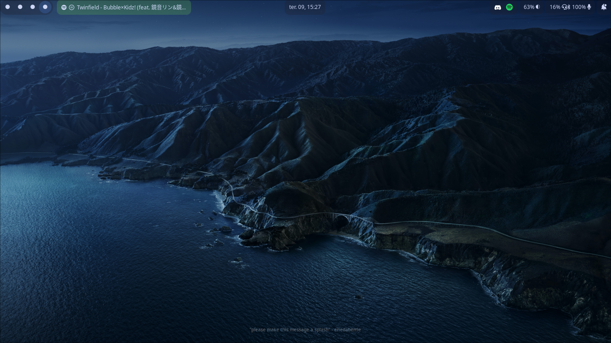
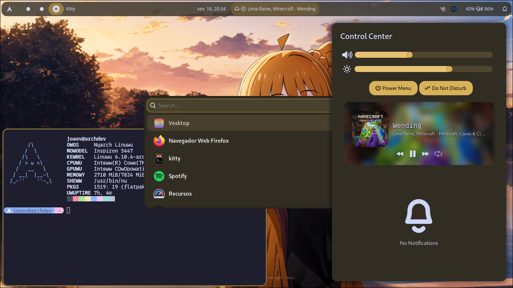
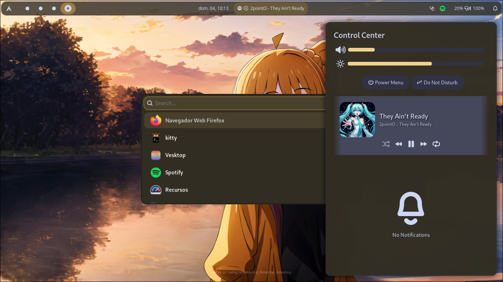

# Retrozinn's Hyprland Dots
My customized Hyprland configuration that I use everyday!

<div align="center">
<div class="screenshot-container">
 
 
 
 
</div>
<br>
 
https://github.com/user-attachments/assets/f67fbeea-637b-44f3-b935-cfdb82680007
</div>

## 🎨 Colors
All the colors are dynamically based on the current wallpaper! This is possible by using [pywal], a cli tool to generate colorschemes by using an image as a base.

## 🖼️ Wallpapers
When you're at the [Installation] process, you can choose to copy my dotfiles' wallpapers folder. If you chose to copy, you can change the current wallpaper by pressing <kbd>SUPER</kbd> + <kbd>W</kbd>, or clicking to change wallpaper in the Control Center.

## Installation
You'll need to have installed all needed packages before installing my dotfiles! Use your package manager to do so. See needed packages on [`Wiki/Dependencies`].

In order to install this style right away, just run this installation script:

> ℹ️ Notice: the installation script will make a backup folder containing all previous files in `~/hyprland-dots-bkp`.

> ❕ Tip: Note the `$` character means that it's recommended to run this command without root privileges.

```nushell
 $ git clone "https://github.com/retrozinndev/Hyprland-Dots.git"; cd Hyprland-Dots; bash apply.sh
```

### ❔ How to Use
See usage and other relevant info on the [Wiki].

## ❗ Issues
Got any issue? Please create a [new Issue], I'll be happy for helping you out!

## 📜 License
This repo is licensed under the [GNU General Public License 3.0].


<!-- References(Other repos / websites) -->
[pywal]: https://github.com/dylanaraps/pywal
[gnu general public license 3.0]: https://www.gnu.org/licenses/gpl-3.0.pt.html#license-text

<!-- Tabs -->
[wiki]: https://github.com/retrozinndev/Hyprland-Dots/wiki
[issues]: https://github.com/retrozinndev/Hyprland-Dots/issues

<!-- Wiki Pages -->
[`wiki/dependencies`]: https://github.com/retrozinndev/Hyprland-Dots/wiki/Dependencies

<!-- Action Links -->
[new issue]: https://github.com/retrozinndev/Hyprland-Dots/issues/new
